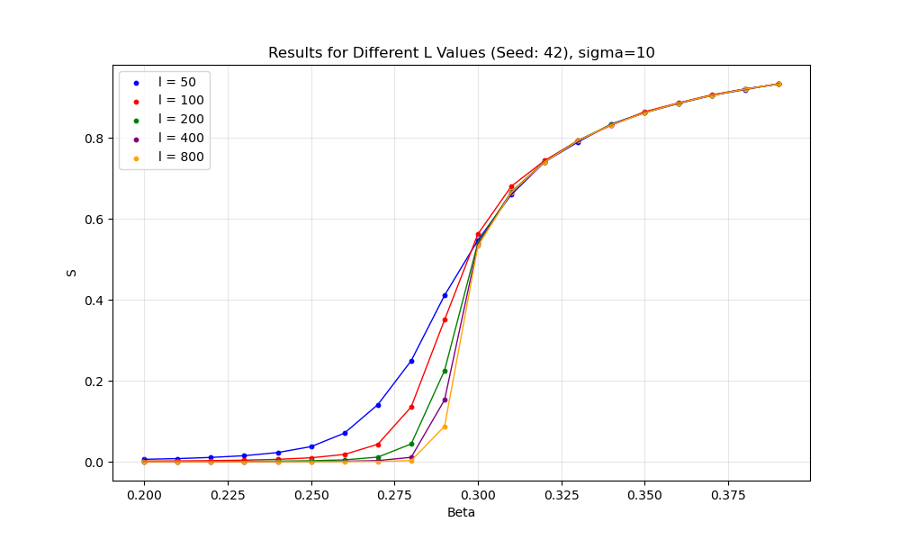

# Long-Range Percolation Core

## Build

Either (with flakes)
```bash
nix build  # builds the rust crate
nix shell .#lr_percolation-python-env # rebuilds and enters a shell with a python knowing lr_percolation
```

or manually (needs rust and python with maturin installed) (untested)

```bash
cargo build  # builds the rust crate
maturin build --release --features python-bindings
```

## Use

Create `flake.nix` with the following content

```nix
{
  description = "Percolation experiments";
  inputs = {
    nixpkgs.url = "github:NixOS/nixpkgs?ref=nixpkgs-unstable";
    utils.url = "github:numtide/flake-utils";
    lr-percolation.url = "github:ochsnerd/lr-percolation";
  };
  outputs = { self, nixpkgs, utils, lr-percolation }: (utils.lib.eachSystem ["x86_64-linux" ] (system:
    let
      pkgs = nixpkgs.legacyPackages.${system};
      lrPython = lr-percolation.outputs.packages.${system}.lr_percolation-python-env;
      envPython = pkgs.python310.withPackages(ps: with ps; [
        numpy
        matplotlib
        # add other python packages here
      ]);
    in rec {
      packages = {
        pythonEnv = envPython;
        lrPercolationEnv = lrPython;
      };

      defaultPackage = packages.pythonEnv;

      devShell = pkgs.mkShell {
        buildInputs = [
          envPython
          lrPython
        ];

        shellHook = ''
          export PYTHONPATH="${lrPython}/${lrPython.sitePackages}:${envPython}/${envPython.sitePackages}:$PYTHONPATH"
        '';
      };
    }
  ));
}
```

Then run `nix develop` to get a shell with the python environment.

An example usage could look like this:
```python
import lr_percolation as lrp
import numpy as np
import matplotlib.pyplot as plt


def avg_avg_size(obs):
    return np.average([o.average_size for o in obs])


def main():
    ls = [50, 100, 500]
    sigma = 10
    num_samples = 100
    seed = 42

    plt.figure(figsize=(10, 6))
    colors = [
        "blue",
        "red",
        "green",
        "purple",
        "orange",
    ]

    betas = list(np.arange(0.2, 0.4, 0.01))

    for i, l in enumerate(ls):
        print(f"Processing L = {l}...")

        sizes = [
            avg_avg_size(
                lrp.simulate(
                    l,
                    sigma,
                    beta,
                    num_samples,
                    seed + 1,
                )
            ) / (l * l)
            for beta in betas
        ]
        plt.plot(
            betas, sizes, color=colors[i % len(colors)], linestyle="-", linewidth=1
        )
        plt.scatter(betas, sizes, s=10, color=colors[i % len(colors)], label=f"l = {l}")

    plt.legend(loc="best")
    plt.xlabel("Beta")
    plt.ylabel("S")
    plt.title(f"Results for Different L Values (Seed: {seed}), sigma={sigma}")
    plt.grid(True, alpha=0.3)

    plt.savefig(f"percolation_results_sigma_{sigma}.png")
    plt.show()


if __name__ == "__main__":
    main()
```

This takes 2 minutes on my machine and results in



# TODO

1. Make pyo3 export type info, function signatures
2. Address overflow issue when computing observables
3. Move check out of geometric_skip
4. convice rust lsp that stuff is not unused, even if it's behind the python feature flag
5. figure out if what we're doing in the interface is grossly inefficient
6. figure out if I can control compilaton flags - I would have expected not to get the overfow-panic in the package build
